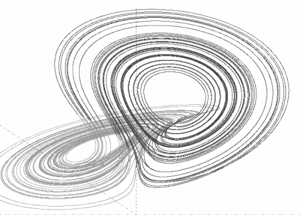

# 새로운 중력 이론을 찾아서

## Introduction - 소개

물리학은 근본적인 이론 측면에서 바라볼때 수십년간 발전이 없는 정체된 그래서 지루한 시간을 보내고 있다. 물리학은 여전히 양자역학과 중력이론을 통합시키기 위해 노력하고 있지만 획기적인 발전이라 칭할 만한 결과물을 만들어내지 못하고 그래서 요즘 그들의 주제는 두개의 중요한 이론을 합치려는 노력을 할때 그것을 막는 걸림돌이 무엇인가에 대한 서로의 공통적 이해와 공감을 공유하는 것이라는 개인적 생각을 떨치기 어려울 정도이다.

수많은 걸림돌 중에서 가장 핵심적인 것은 공간과 시간에 대한 이해가 아직 부족하다는 점을 들 수 있다. 미시세계의 운동을 다루는 양자역학에서의 시간과 공간 개념은 거시세계의 힘을 관장하는 중력을 다루는 아인슈타인의 일반상대성 이론에서의 그것과 호환되지 않는다는 물리학자들의 불편함이 바로 시간과 공간에 대한 정확한 이해를 아직 가지고 있지 못하다는 고백이다. 미시세계에서 시간과 공간은 정적이고 절대적인 공간이지만 일반상대성 이론에서는 시간과 공간이 합쳐진 시공간이 마치 고무판처럼 구부러지고 휘어질수 있는 특성을 가진다. 그렇다면 미시세계에서의 시공간이 거시 세계에서의 시공간과 서로 다른 특징을 보여주는 것처럼 보이기에 다른 존재일 수도 있다고 생각하기란 어렵다. 시간과 공간은 축적을 가리지 않는다고 보아야 한다. 그렇다면 우리에 관측이나 논리적 결과물에서 시간과 공간이 축척에 따라 왜 다른 특성을 가지는 것처럼 보이는가에 대한 의문을 제기하는 것은 당연한 것이 된다. 이 논문은 이러한 질문에 답을 제시하기 위해 작성되었다.

시간과 공간의 특성을 가장 잘 알수 있게 해주는 유일한 이론적 토대가 현재는 아인슈타인의 일반 상대성 이론이다. 이 이론에서는 위에서도 언급했듯이 시간과 공간은 휘어지고 구부러 질 수 있는 역동적인 개체로 취급된다. 그리고 휘어지고 구부러질 수 있는 정도는 질량을 가진 물체의 존재에 의해 결정된다고 이론은 설명하고 있다. 이 말을 다시 곱씹어 보면 다음과 같은 결론을 도출해 낼 수 있다. 시간과 공간만이 존재하고 물체가 존재하지 않는다면 시간과 공간은 그 자체만으로 변화하지 않고 시작된 구조형태를 영원히 유지할 것이라는 점이다. 여기서 우리는 중요한 아이디어를 하나 얻을 수 있다. 물체의 존재가 시간과 공간에 영향을 준다는 점이다. 여기까지 읽은 독자들은 별 무리없이 수긍할 수 있을 것이다. 하지만 필자는 여기서 쉽게 예상하기 힘든 상당히 파격적인 관점을 소개하고자 한다. 헛소리처럼 들릴게 뻔하지만 과거 수십년간 물리학자들이 별다른 성과없이 지내왔다는 것을 생각해볼 때 그리고 과학의 혁신적 진보는 때때로 막스 플랑크의 양자론과 같이 헛소리에서 시작했던 것을 떠올려 본다면 충분히 해볼만한 가치가 있다고 필자는 생각한다.

## Nothing comes from nothing
이러한 주장을 Parmenides가 직접적으로 했다는 근거는 찾아볼수 없지만 일반적으로 Parmenides가 이러한 사상의 최초 주창자로 인정되고 있다. 여기서 필자는 누가 이 주장을 먼저 했는지에 대해 깊이 파고들 생각은 없다. 다만 필자가 곧 주장하게 될 우주를 구성하는 3가지 - `공간`, `시간`, `에너지입자` -의 존재를 가정하고, 이를 독자들이 비교적 거부감없이 받아들이는데 도와줄 근거를 찾고자 할 따름이다. 아무것도 없는 상태에서 어떤 것이 나타날수 있다고 상상하기 어렵다은 상식은 위에서 소개한 대로 고대 그리스부터 내려오는 사상이기에 이를 아는 독자들 또한 기본적인 구성요소의 존재를 인정하는데 거부감을 느끼지 않을 것이라 생각한다. 

기본적인 구성요소의 존재를 인정해야 한다면 그 이후의 수순으로 그럼 어느 정도로 더 이상 쪼갤수 없는 구성요소를 상정할 수 있을 것인지 결정해야 한다. 아리스토텔레스가 우주를 구성하는 기본요소를 불,흙, 공기, 물 이렇게 4가지로 제시하고 이를 통해 우주의 변화를 설명하고자 노력했듯이 필자 역시 위와 같은 세가지의 구성요소를 가지고 새로운 중력에 대한 관점을 소개하고자 한다.

그러면 우주를 구성하는 이 세가지 기본 구성 요소가 어떻게 상호 작용을 하는지에 대해 필자의 견해를 소개해 보자. 필자의 견해는 다음과 같은 순서로 진행될 것이다. 우선 새로운 관점의 도입을 보다 쉽게 적응할 수 있게 하기 위해 다소 추상적이고 철학적이만 직관적인 내용을 먼저 소개한 후 과학적인 내용을 이어서 전개할 것이다. 이러한 접근 방식을 통해 보다 독자들이 잘 이해하기가 편할 것이라 본다.

## 시간과 공간 그 자체는 불변이고 다만 물체에 의해 왜곡된다.

우주를 구성하는 요소중 `에너지입자`는 우주에 존재하는 별, 인간, 원자, 전자, 쿼크 등과 같은 모든 물체를 구성하는 가장 기본 요소이다. *시간*과 *공간*을 이런 존재라고 가정해보자. *시간*과 *공간*은 그 자체로 불변이고 절대 변하지 않는다. *시간*과 *공간*이 변하는 것처럼 보이는 것은 *시간*과 *공간*을 경험하는 물체가 가지는 환상일 뿐이다. 이러한 관점은 고대 그리스 철학자인 Parmenides의 `실체`와 `허상`을 주제로 삼은 존재론의 사상과 일맥상통한다. 하나의 객체는 두가지의 양면 즉 `실체` 와 그것을 감지하는 관측자가 느끼는 `허상`을 가지는 것으로 이해 될 수 있다. *시간*과 *공간*의 `실체`는 변화하지 않고 죽지도 않으며 항상 존재한다. 하지만 물체는 변화하지 않는 `실체`를 왜곡없이 인식할 수 없고, 물체 상태에 따라 `실체`를 왜곡하고 이 어그러진 `허상`만을 인식할 뿐이다. 여기까지는 추상적이고 철학적인 내용으로 이제 좀더 과학적인 내용으로 덧대어 보자.

다시 `에너지입자`로 돌아가 이것의 기본 모델에 대해서 가설의 형태로 좀더 소개해보자. 줄여서 `기본입자`는 시간과 공간안에 존재하는 점과도 같은 존재로 가정된다. 이 `입자`는 `시간` 과 `공간`에서 쪼개지거나 사라지지 않는다. `입자`는 에너지라는 +1 `회전` 또는 -1 `회전`을 속성으로 가진다. 여기서 `회전`이라 함은  3개의 차원으로 이루어진 공간에서 `입지`가 일정한 방향으로 궤적을 그리며 무한히 움직이는 것으로 가정된다. 현재 입자의 정확한 운동을 기술하는 수학방정식은 알려진게 없지만 가장 근사한 형태로  Chaos이론에서 나오는 이상한 끌개(Strange attractor)의 궤적을 들 수 있다.

`점입자`는 일정한 방향으로 회전하는 궤적을 3차원 공간상에 그리는 것으로 가정되었는데 특이할 만한 것은 이 궤적이 Strange Attractor의 특성처럼 자체적으로 교차하지 않고 이어지지 않는 다는 점이다. 그리고 이렇게 궤적이 교차하지 않으면서 끝이 없이 무한히 회전하는데, 움직이는 변화에 필요한 시간비용이 전혀 들지 않아서 다시 말해서 순식간에 모든 변화가 완성된 인간이 보기에는 마치 끈이론(String theory)에서 소개되는 진동하는 끈처럼 보인다는 점이다. 이는 마치 옛날 브라운관 TV에서 처럼 전기총에서 쏘아보내는 전자에 의해 화면에 맺히는 것은 하나의 점이지만 이를 빠르게 이동해서 이것을 보는 인간의 눈에는 마치 2차원의 화면으로 인식되게끔 하는 원리와 비슷하다 할 수 있다.
