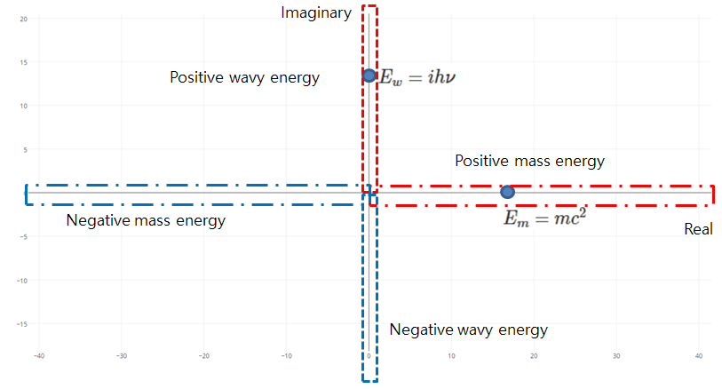

# Unveiling secrete hidden in Einstein's $E=mc^2$

Oh YoungJong(dmqcka@gmail.com)

## Introduction

What I am telling now is a new idea you never heard of. It is the result of my sole studies for last few years to understand a simple question: Does subatomic particle feel the space and time as we human feel space and time? Can we human know the exact motion of the elementary particle in space and time? I know Quantum mechanics says it is impossible for us to know the position and momentum of it at the same time due to Heisenberg's Uncertainty principle. Although I didn't majored any regular physics course in university, I have been curious on Physics especially in the all weird phenomena mentioned in Quantum mechanics and General relativity and made some satisfactory outcome with help of many YouTube videos and online materials accessible easily to me. Without many other's kind contributions uploaded freely on web, it would be impossible to write any small piece on this topic. So I think it would be square my debt to open my findings and it is one main reason why I write this paper.

I would like to introduce my conclusion first. Later, there will be a chance to introduce why I get to this conclusion and what obstacles I need to overcome in another post in detail.

## Hamiltonian of a elementary particle.

Simple is the best could be a just belief but strong guidance to direct us to right path. I found a much simpler Hamiltonian expression about the state of elementary particle. In my theory, all fundamental building blocks in our universe is believed to share one single common form which is called *energy*. The Standard model of particle physics list many elementary particles push three fundamental forces but in my view they are treated as just variants of one common form: energy. Again, this writing is about new revolutionary idea on how we can interpret universe.

In my physical model, every particle including photon, electron, quarks is associated with an energy value defined in complex number domain. It was hinted by the wave-particle duality which is the basic property of every observable object. It is 2d complex domain. I chose the horizontal axis is for mass term of the Energy and the vertical axis for wave term. As the vertical axis in 2d complex domain is the imaginary part, the wave axis also is accompanied by imaginary number *i*. For example, a photon's energy is only dependent on its frequency which is the property of wave, expressed as  $E_w=ih\nu$. I am sure readers will laugh at me if I say the wave energy of photon is not real number but imaginary number but bear with me for a while. I am sure readers will accept my view in the end.

On the other hand, the mass term will be positioned at the real axis in 2d complex domain. Einstein's famous equation $E_m=mc^2$ says mass is equivalent to energy but mass is different from light which is also energy. The pure mass and massless light are both energy but in different form.  Mass have a special property preventing movement in space. But light is the fastest object in space so nothing can move faster than light. Mass shows a tendency of reluctance to move but light tends to move faster than anything massive. This observation provided great insight to me and help me to think of the following energy map. In figure 1, every particle with no mass term, i.e. photon, can be positioned only along the vertical axis which is imaginary axis in 2d complex number domain.

Since Max Plank postulated his theory that energy can exist in only quantized form, assuming natural unit is 1, every massless particle can be depicted as a point located at the integer multiples along imaginary axis. It would be helpful to think of Schrodinger equation which has *i* term. I will call it wave energy particle with no mass term. As you already guess, every particle without wave term is called mass energy particle or simply mass energy which can be positioned at the integer multiples along horizontal axis.

Picture 1. Hamiltonian graph for a particle energy.

It is important that there is a room for negative wave energy in the complex domain. All positive wave particle is light we know but negative energy may sound strange to readers. To understand this, it is required to understand what Energy is first.

## What is energy

[Under ]

Dimension ratio for an energy particle is determined by portions of light energy and mass. If a particle has a total energy T, T is linear sum of light energy P and mass energy Q.

$$T=P+Q$$

## Energy transition rule
Light and mass are different forms of energy. As can be seen in nuclear weapon, it means that they can transform to each other under certain rule which I will explain. To explain the rule in more strict way, I will reuse the existing mathematics with some tweaks. Firstly, as Max Planks postulated, energy can exist only in quantized form which means its energy scalar value is integer assuming natural unit 1 for Plank constant *h*. From now on, my new idea and rules will be presented so readers are advised to be patient for them although they sound strange or crazy for time being.

For a photon with energy value higher than 1, it can be thoughts as a single object is composed of multiples of unit energy interacting to each other. Using old mathematics, let me define a unit energy as $E_w=e^i$ for a photon of unit energy and $E_m=e^0$ for a particle with pure mass of unit energy.

1. $$E_w=e^i$$
2. $$E_m=e^0$$

I just defined the most simple 2 forms for a unit energy in wave form and massive form. I will use $e^i$ and $e^0$ as like vector.

 Another definition is the interaction between two energy particle which will be expressed as multiplication. For an example, let me show how the interaction with two energy object can be expressed. Look at below 3 cases.

  3. Interaction of two wave particles of unit energy(obviously photons)
  $$e^ie^i=e^{i(2)}$$
  4. Interaction of one mass energy particle and one mass energy particle
  $$e^0e^0=e^{0(2)}$$
  5. Interaction of N wave particles of unit energy(obviously photons)
  $$e^ie^i...e^i=e^{i(N)}$$
  6. Interaction of one wave energy particle and one mass energy particle
  $$e^ie^0=e^{i(1)}e^{0(1)}$$

In case 3, nothing changes. Repeatedly saying, thinking $e^1$ and $e^0$ as vector symbols will help to get comfortable to accept the above formulas. Using vector symbol, equation 6 can be extended as follows.

  $$e^ie^0=e^{i(1)}e^{0(1)}=\vec{p}^1\vec{m}^1$$

Now it's time to define a rule for energy transforming to another form. From now on, something new interesting rule will show up. Assume here are two wave energy particles with different sign and they are expressed as follows.

7. Positive wave particle of unit energy:
$$e^{i(1)}=\vec{p}^1$$
8. Negative wave particle of unit energy:
$$e^{i(-1)}=\vec{p}^{-1}$$
9. Interaction of them:
$$e^{i(1)}e^{i(-1)}=\vec{p}^{(1)}\vec{p}^{(-1)}=e^{0(1)}e^{0(1)}=\vec{m}^{(1)}\vec{m}^{(1)}=\vec{m}^{(2)}$$

The mathematical expression used to define the interaction of two wave energy particle with different sign is different from one we learned in school. Yes, it is not normal arithmetic operation we are familiar with. I made this rule to show clearly old classical principle, energy conservation law. Readers probably are curious why I need such weird operation. The minus sign used in the above expression is not meant for subtracting energy so the result always decrement in total energy. It is rather close to canceling rotational motion of wave particles while total energy is conserved. Every positive wave particle oscillate within its bounded area in space and shows rotation in 2d plane if the oscillation is projected on to either counter clockwise or clockwise direction. This unique property will be explained in the part for What is energy.

The important thing you must know here is that the interaction of two wave energy particles with different sign transform them into mass energy of two unit energy. The equation 9 is great because it will support strongly my story is actually telling something closer to reality. Why? Some may notice $\vec{m}^{(2)}$ in equation 9 and getting an insight from it. What do you think about it? Let me explain my interpretation here.

Our universe is decided by few constants such as *h* and *c* which are closely related with energy. *h* is used in photon energy equation $E=h\nu$ and *c* is used in Einstein's famous equation $E=mc^2$. Here we can ask a simple question: why *c* is squared while *h* is unsquared? The question 9 shows us the reasonable and precise answer for that question which nobody answer or even try it.

## Side note: Physical meaning of various energies in mathematical expressions used in here.

It is a side note before to continue the discussion. This part is the result of my imagination which will help readers to understand why I need to think something crazy and abnormal to whom worked in conventional field in quantum mechanics and general relativity.

1. Positive wave energy particle: Photon
    - $e^{i(N)}$, where *N* is a natural number.
    - This particle is normal massless photon which we can measure and detect with our own eye. *N* is normal known to have a 1:1 map with the frequency of a photon in Quantum mechanics. In my view here, if *N* is higher than 1, then it is considered single composite particle united by interactions of N unit wave particles.
    - If *N* is not zero, it means it have a certain wave length, what Plank/Einstein equation tells, so it occupies some finite area or bounded area in our 3 dimensional space.
    - In my model, every object with non-zero wave energy is believed as a particle orbiting at the center of the bounded area in our 3d space.
    - The direction of angular motion projected onto 2d plane out of orbiting motion in 3d space is assumed to be counter clockwise to be compatible with the complex number domain.
    - The orbiting motion is timeless and **the trajectory of a particle formed by timeless orbiting motion in a bounded region can be described as a string** which is believed as the fundamental building block in String theory. Timeless motion may puzzle readers so I will do my best to explain what it means and why I needed the notion in detail when gravity will be discussed in later section. For now, I am very sorry to ask readers just accept my arguing what **timeless** means is that $dt=0$ with enough explanation. I hope that all puzzling things will be cleared at the gravity section.
    - Interaction of two particles seems to happen only when the bounded region of two particles overlaps. The exact condition to complete the interaction so that they are united to be a single moving object is unclear for now. But the result of interaction of  two photons is the increment of frequency of the newly created particle out for input particles.

2. Negative wave energy particle: Anti photon
    - $e^{i(-N)}$, where *N* is a natural number.
    - This particle is almost same to photon with one difference: the direction of orbiting motion. The direction of orbiting motion of negative wave particle is opposite to the photon.
    - Possible interactions:
        1. negative wave energy and negative energy: The result of interaction is the increment of energy magnitude which is the frequency of self orbiting particle with negative sign.
        2. Negative wave energy and positive energy: The only result of interaction we can observe(if possible due to technology development) is the energy transformation to mass form. This means we human cannot detect the existence of negative wave energy directly because it changes its form into mass when it meet and interact with positive wave energy, photon.
    - Anti photon and photon both are fastest moving particles in 3d space as long as they are in timeless orbiting motion within their own bounded region. The detailed meaning of "timeless orbiting motion", "bounded region" will be explained in the section what energy means.

3. Positive mass particle
    - equivalent mathematical expression: $e^{0(2M)}$, where *M* is a natural number.
    - It is pure mass particle because it have no wave particle. A mass particle is consisted of two wave particles, one is positive wave particle and the other is negative energy particle so the energy value of every pure mass particles is even numbered. It means a wave particle can be transformed to a mass particle after joining with a negative wave particle which is undetectable to us human and merged into single object. This logical deduction can be used to explain why *c* in $E=mc^2$ is squared and *h* in $E=h\nu$ is unsquared.

## Application

The energy model introduced in the previous section enable us to think of the Hamiltonian of a particle system as follows.
Suppose that there are three positive and two negative wave particles and they are to be merged into a single composite particle.
